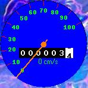



## Mouse Odometer

### Description

this program tracks the speed of you mouse cursor in cm/s and keeps track in meters how far the cursor has gone...it displays this in an odometer, like from a car...check it out
 
### More Info
 

             |
---                |---
**Submitted On**   |2002-08-22 03:04:12
**By**             |[RyRy DuPont](https://github.com/Planet-Source-Code/PSCIndex/blob/master/ByAuthor/ryry-dupont.md)
**Level**          |Beginner
**User Rating**    |4.7 (42 globes from 9 users)
**Compatibility**  |VB 6\.0
**Category**       |[Miscellaneous](https://github.com/Planet-Source-Code/PSCIndex/blob/master/ByCategory/miscellaneous__1-1.md)
**World**          |[Visual Basic](https://github.com/Planet-Source-Code/PSCIndex/blob/master/ByWorld/visual-basic.md)
**Archive File**   |[Mouse\_Odom1209568222002\.zip](https://github.com/Planet-Source-Code/ryry-dupont-mouse-odometer__1-38171/archive/master.zip)

